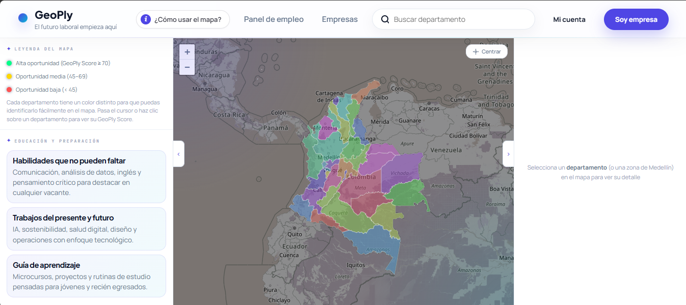
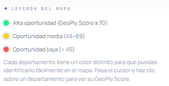

# GeoPly — Inteligencia Territorial para el Mercado Laboral en Colombia

Proyecto: GeoPly — Inteligencia Territorial para el Mercado Laboral en Colombia  
Concurso: Datos Abiertos de Colombia — Categoría Intermedia  
Reto: Economía y Empleo — Tableros inteligentes para tendencias de empleo y sectores emergentes  
Fecha: 9/07/2026

> Plataforma web de visualización geoespacial que integra datos abiertos del gobierno colombiano para analizar oportunidades laborales, tendencias de empleo y dinámicas del mercado de trabajo por departamento y municipio.



---

## ¿Qué problema resuelve?

En Colombia, los datos del mercado laboral existen pero están dispersos en decenas de datasets de [datos.gov.co](https://datos.gov.co). Un ciudadano que busca empleo, un investigador que analiza tendencias o una entidad pública que diseña políticas no tiene forma sencilla de ver ese panorama completo en un solo lugar, mucho menos de entender *dónde* están ocurriendo las cosas.

GeoPly resuelve exactamente eso: toma los datos abiertos del SENA, el DANE y el Ministerio del Trabajo, los consulta desde la fuente y los presenta sobre un mapa de Colombia con análisis, gráficas y marcadores geolocalizados, sin que el usuario necesite saber de estadística ni de programación.

---

## Objetivos

### Objetivo general

Desarrollar una plataforma web que integre múltiples fuentes de datos abiertos para analizar las oportunidades laborales en Colombia mediante indicadores territoriales y visualizaciones interactivas que apoyen la toma de decisiones de ciudadanos, investigadores y entidades públicas.

### Objetivos específicos

- Integrar datasets públicos de datos.gov.co que describan el mercado laboral colombiano desde distintos ángulos: oferta, demanda, sectores, formación e indicadores socioeconómicos.
- Analizar indicadores laborales clave (desempleo, ocupación, informalidad) a escala departamental y municipal.
- Calcular un Índice de Oportunidad Laboral compuesto que permita comparar territorios de forma interpretable y accionable.
- Mostrar los resultados geográficamente sobre un mapa interactivo de Colombia con capas diferenciadas por sector y nivel de oportunidad.

## Metodología

El desarrollo del proyecto siguió los principios de CRISP-ML, abordando sus etapas de manera iterativa:

1. Comprensión del problema — Identificación de la brecha entre la disponibilidad de datos laborales públicos y su accesibilidad para usuarios no técnicos.
2. Comprensión de los datos — Exploración de los once datasets de datos.gov.co con el script `fletch_empleo_data.py`, que inspecciona campos, tipos y ejemplos de cada fuente.
3. Preparación de la información — Normalización geográfica de registros (resolución de nombres de municipio/departamento a coordenadas), limpieza de campos y unificación de esquemas heterogéneos.
4. Desarrollo de la solución — Construcción del mapa interactivo, el dashboard y el Índice de Oportunidad compuesto.
5. Evaluación — Verificación de cobertura territorial (33 departamentos), consistencia de los scores y coherencia entre los datos de las APIs y los indicadores visualizados.
6. Impacto esperado — Identificado en la sección correspondiente más abajo.

---

## ¿Qué hace GeoPly?

GeoPly es una plataforma de inteligencia territorial que pone el mercado laboral colombiano sobre el mapa, literalmente. Al abrirla, el usuario encuentra un mapa oscuro de Colombia con capas de calor y marcadores que representan la intensidad de oportunidades laborales por región, construidas a partir de los datos consultados desde las APIs del gobierno. La información se carga desde datos.gov.co al momento de la consulta, de modo que siempre refleja lo disponible en la fuente oficial.

Al seleccionar cualquier departamento o municipio en el mapa, se despliega un panel lateral con un análisis detallado de esa zona: tasa de desempleo, tasa de ocupación, nivel de informalidad, crecimiento poblacional proyectado y el **Índice de Oportunidad** propio de GeoPly. Este índice se puede recalcular según el tipo de sector que el usuario quiera explorar: cafetería, restaurante, tienda, servicios de salud o emprendimiento digital, cada uno con su propia fórmula de ponderación.

Paralelo al mapa, GeoPly genera un dashboard interactivo que consolida los datos de las once APIs conectadas en gráficas, tendencias y comparaciones entre departamentos. Cada registro que llega de la API es geolocalizado automáticamente: si trae coordenadas se ubica con precisión; si solo trae nombre de municipio o departamento, el sistema lo resuelve y lo posiciona igualmente en el mapa. Todo esto ocurre dentro de una sola pantalla, sin páginas adicionales, pensada para que un ciudadano, un investigador o un funcionario público puedan leer el panorama laboral de Colombia de un vistazo y profundizar donde les interese.

---

## El Índice de Oportunidad

El Índice de Oportunidad es un indicador desarrollado por el equipo que resume múltiples variables del mercado laboral en una escala de 0 a 100. Su propósito no es predecir el futuro, sino **facilitar la comparación relativa entre territorios** mediante una única medida interpretable por cualquier usuario.

El índice integra cinco dimensiones:

| Dimensión | Variables consideradas |
|---|---|
| **Crecimiento** | Proyección de población 2030, variación respecto a 2018 |
| **Transporte** | Acceso y conectividad territorial |
| **Espacio de entrada** | Densidad comercial existente (baja densidad = mayor oportunidad) |
| **Seguridad** | Índice de condiciones de seguridad de la zona |
| **Actividad social** | Indicadores de dinámica comunitaria y económica |

Según su resultado, cada zona se clasifica en tres niveles:

- 🟢 Alta oportunidad — score ≥ 70
- 🟡 Oportunidad media — score entre 45 y 69
- 🔴 Oportunidad baja — score < 45



---

## Arquitectura general

```
Datos abiertos (datos.gov.co)
         │
         ▼
   Consulta por API (SODA)
         │
         ▼
   Procesamiento y normalización
   (geo-data.js · fletch_empleo_data.py)
         │
         ▼
   Cálculo del Índice de Oportunidad
   (indicators.js · dashboard.js)
         │
         ▼
   Visualización en mapa + dashboard
   (app.js · index.html)
         │
         ▼
   Análisis territorial por el usuario
```

---

## Fuentes de datos

Estos conjuntos de datos fueron seleccionados porque describen variables clave del mercado laboral colombiano desde ángulos complementarios: empleabilidad, oferta laboral, demanda empresarial, formación, ocupación e indicadores socioeconómicos. Su integración permite construir una visión territorial más completa que la obtenida a partir de una sola fuente.

|   Dataset   | Contenido |
| `yix6-7yeh` | Indicadores del mercado laboral |
| `2c7k-9iru` | Vacantes de empleo |
| `khhm-wccm` | Demanda laboral por sector |
| `xs69-evan` | Oferta de empleo |
| `2v94-3ypi` | Perfiles ocupacionales |
| `canv-4tj3` | Estadísticas de empleo |
| `daed-z4fw` | Tendencias de contratación |
| `tgvn-r2n9` | Empleabilidad regional |
| `fvq4-wwtz` | Sectores económicos |
| `8pqf-rmzr` | Formación para el empleo |
| `28vu-5tx7` | Registro general de referencia |

Todos se consumen en tiempo real mediante la SODA API de datos.gov.co (sin autenticación requerida), con un límite configurable de registros por consulta.

---

## Tecnología utilizada

### Frontend
- **HTML5 / CSS3 / JavaScript (ES2020+)** — sin frameworks, arquitectura modular por archivos
- **[Leaflet.js](https://leafletjs.com/) v1.9.4** — mapas interactivos con soporte de capas, popups y marcadores
- **Leaflet.heat** — capa de mapa de calor para visualizar densidad de oportunidades
- **OpenStreetMap** — tiles base del mapa, filtrados con CSS para estética oscura
- **Google Fonts** — tipografía DM Sans + DM Mono

### Backend
- **Node.js + Express** — servidor de archivos estáticos y API REST interna
- **MySQL2** — base de datos relacional para aspirantes, vacantes y organizaciones
- **Python 3** *(script auxiliar)* — inspección y caché local de los datasets durante el desarrollo

### Estructura de archivos
```
/
├── index.html              # Shell principal de la aplicación
├── styles.css              # Diseño completo (tema oscuro, componentes)
├── app.js                  # Lógica del mapa, filtros y panel de análisis
├── dashboard.js            # Conexión y renderizado del dashboard de APIs
├── indicators.js           # Cálculo de indicadores y scores
├── geo-data.js             # Normalización geográfica y coordenadas
├── geo-boundaries.js       # Límites departamentales
├── departamentos-data.js   # Datos base de empleo por departamento
├── server.js               # Servidor Express + endpoints MySQL
├── package.json            # Dependencias Node.js
└── fletch_empleo_data.py   # Script de inspección de APIs (desarrollo)
```

---

## Cómo ejecutar el proyecto

### Requisitos previos
- Node.js ≥ 18
- MySQL ≥ 8 *(opcional — solo para funciones de registro de aspirantes y vacantes)*
- Python 3.8+ *(opcional — solo para el script de inspección de APIs)*

### Instalación rápida

```bash
# 1. Clonar el repositorio
git clone https://github.com/malvaceda/GEOPLY.git
cd geoply

# 2. Instalar dependencias
npm install

# 3. Iniciar el servidor
npm start
# → Disponible en http://localhost:3000
```

> Modo sin backend: También puedes abrir `index.html` directamente en el navegador. El mapa y el dashboard funcionan sin servidor; solo las funciones de registro de aspirantes y vacantes requieren MySQL.

### Configuración de base de datos (opcional)

```bash
DB_HOST=localhost
DB_USER=root
DB_PASSWORD=tu_contraseña
DB_NAME=geoply_empleo
```

### Script de inspección de APIs

```bash
python3 fletch_empleo_data.py --limit 20 --schema
# Muestra los campos disponibles en cada dataset sin guardar caché

python3 fletch_empleo_data.py --limit 50 --out cache_local.json
# Guarda una caché local de los datos para desarrollo offline
```

---

## Principales resultados

### Cobertura territorial
- **33 departamentos** de Colombia con datos de empleo geolocalizados
- **+50 municipios** con coordenadas mapeadas en `geo-data.js`
- Métricas ejemplo para Antioquia: TD 7.51% · TO 59.48% · TGP 64.31%

### Indicadores nacionales integrados

|           Indicador           | Valor |
| Tasa de informalidad nacional | 54.2% |
|   Población ocupada (miles)   | 24,27 |
| Tasa de desocupación reciente | 8.94% |
| Crecimiento ocupados universitarios 2010–2024 | +106.7% |

### Capacidades de análisis
- Score de oportunidad calculado por región en escala 0–100 pts
- Clasificación automática de zonas: alta oportunidad (≥65), emergente (55–64), saturada (<45)
- Comparación de tendencias entre departamentos con datos históricos (2018 vs. actual)
- Análisis de brecha de género en desocupación (ejemplo Bogotá: hombres 7.5% vs. mujeres 8.91%)

---

## Impacto esperado

### Social
- Facilita el acceso ciudadano a información laboral pública de forma visual e interpretable.
- Reduce la barrera técnica para entender los datos abiertos del gobierno colombiano.
- Permite a personas en búsqueda de empleo identificar regiones con mayor dinamismo laboral.

### Económico
- Apoya decisiones sobre movilidad laboral y búsqueda de oportunidades por sector.
- Permite a emprendedores y empresas identificar territorios con potencial de demanda insatisfecha.

### Institucional
- Puede servir como herramienta de apoyo para análisis territoriales y formulación de políticas públicas de empleo.
- Demuestra el valor práctico de los datos abiertos cuando se combinan con visualización accesible.

---

## Contexto del proyecto

GeoPly fue desarrollado para el **Concurso de Datos Abiertos de Colombia**, con el objetivo de demostrar el valor de los datos públicos de datos.gov.co cuando se combinan con visualización geoespacial y análisis territorial accesible para cualquier ciudadano.

El proyecto busca responder una pregunta central: **¿dónde están las oportunidades del mercado laboral en Colombia y cómo evolucionan?**

---

## Licencia

Este proyecto utiliza datos públicos del Gobierno de Colombia bajo los términos de la [Licencia de Datos Abiertos Gov.co](https://www.datos.gov.co/). El código fuente es de uso libre para fines académicos y de investigación.

---

*Desarrollado desde Medellín, Antioquia.*